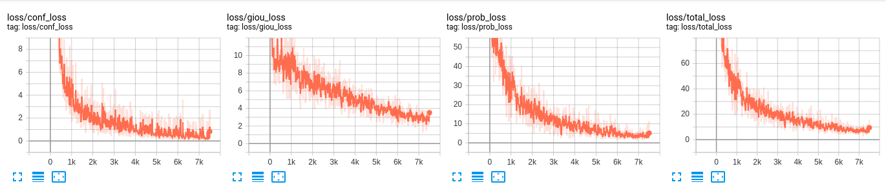
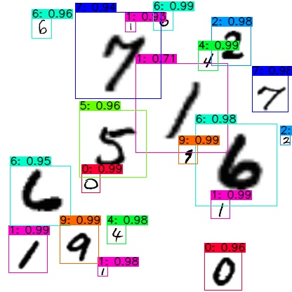

# [TensorFlow2.x-YOLOv3](https://github.com/YunYang1994/Easy-Deep-Learning/blob/master/YOLOv3.md)
--------------------
A minimal tensorflow implementation of YOLOv3, with support for training, inference and evaluation.

## Installation
--------------------
Install requirements and download pretrained weights

```
$ pip3 install -r ./docs/requirements.txt
$ wget https://pjreddie.com/media/files/yolov3.weights
```

## Quick start
--------------------
In this part, we will use pretrained weights to make predictions on both image and video.

```
$ python image_demo.py
$ python video_demo.py # if use camera, set video_path = 0
```


## Train yymnist
--------------------
Download [yymnist](https://github.com/YunYang1994/yymnist) dataset and make data.

```
$ git clone https://github.com/YunYang1994/yymnist.git
$ python yymnist/make_data.py --images_num 1000 --images_path ./data/dataset/train --labels_txt ./data/dataset/yymnist_train.txt
$ python yymnist/make_data.py --images_num 200  --images_path ./data/dataset/test  --labels_txt ./data/dataset/yymnist_test.txt
```
Open `./core/config.py` and do some configurations
```
__C.YOLO.CLASSES                = "./data/classes/yymnist.names"
```

Finally, you can train it and then evaluate your model

```
$ python train.py
$ tensorboard --logdir ./data/log
$ python test.py
$ cd ../mAP
$ python main.py        # Detection images are expected to save in `YOLOV3/data/detection`
```
Track training progress in Tensorboard and go to http://localhost:6006/

```
$ tensorboard --logdir ./data/log
```


| train |test|
|---|---
|||

## Citation
--------------------
```
@Github_Project{TensorFlow2.0-Examples,
  author       = YunYang1994,
  email        = www.dreameryangyun@sjtu.edu.cn,
  title        = "YOLOv3: An Incremental Improvement",
  url          = https://github.com/YunYang1994/TensorFlow2.0-Examples,
  year         = 2019,
}
```

