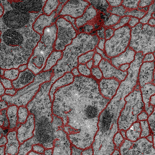

# U-Net: Convolutional Networks for Biomedical Image Segmentation.


```bashrc
$ git clone https://github.com/YunYang1994/membrane.git
$ python train.py
$ python test.py
```

| input | result |
|---|:---:|
|||
|||