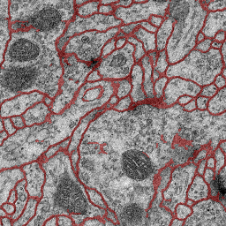

## U-Net: Convolutional Networks for Biomedical Image Segmentation.
--------------------
 [this paper](https://arxiv.org/abs/1505.04597) presents a network and training strategy that relies on the strong use of data augmentation to use the available annotated samples more efficiently. The architecture consists of a contracting path to capture context and a symmetric expanding path that enables precise localization.

## Train membrane
--------------------
[membrane](https://github.com/YunYang1994/membrane) contains 90 images for training and 30 for testing.  The corresponding binary labels are provided in an in-out fashion, i.e. white for the pixels of segmented objects and black for the rest of pixels (which correspond mostly to membranes)

| input | ground truth | prediction |
|---|---|:---:|
||||
||||

Finally, you can train it and then evaluate your model

```bashrc
$ git clone https://github.com/YunYang1994/membrane.git
$ python train.py
$ python test.py
```
## Citation

```
@InProceedings{RFB15a,
  author       = "O. Ronneberger and P.Fischer and T. Brox",
  title        = "U-Net: Convolutional Networks for Biomedical Image Segmentation",
  booktitle    = "Medical Image Computing and Computer-Assisted Intervention (MICCAI)",
  note         = "(available on arXiv:1505.04597 [cs.CV])",
  url          = "http://lmb.informatik.uni-freiburg.de/Publications/2015/RFB15a"
}
```