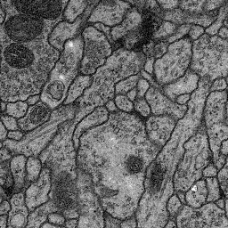
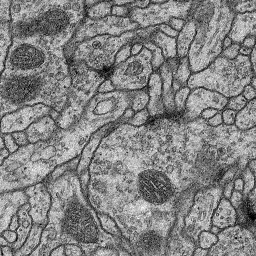
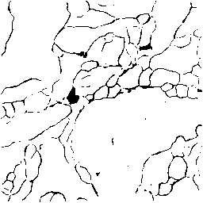

# U-Net: Convolutional Networks for Biomedical Image Segmentation.


| input | ground truth | prediction |
|---|---|:---:|
||||
||||

```bashrc
$ git clone https://github.com/YunYang1994/membrane.git
$ python train.py
$ python test.py
```